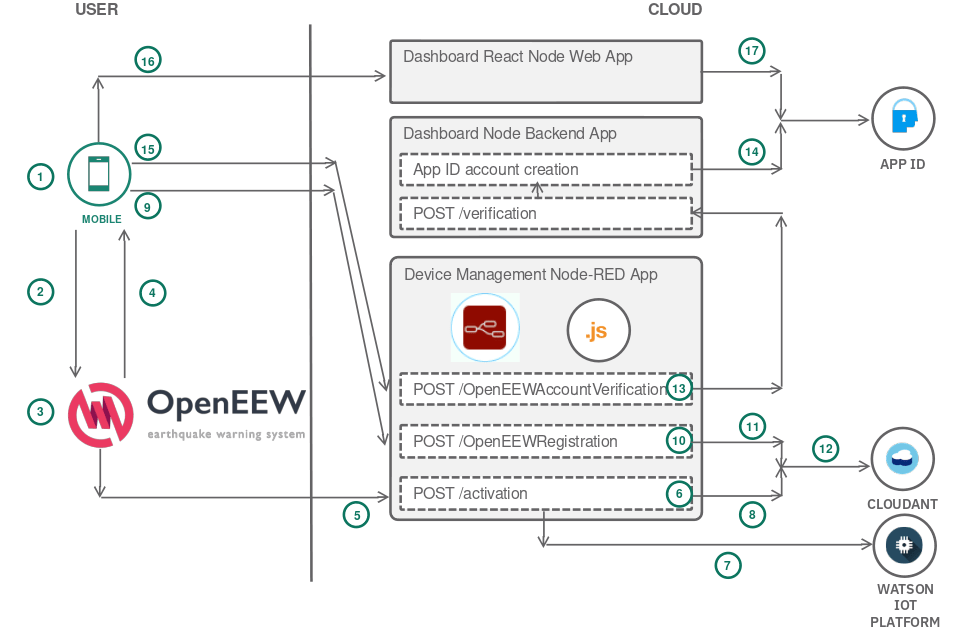
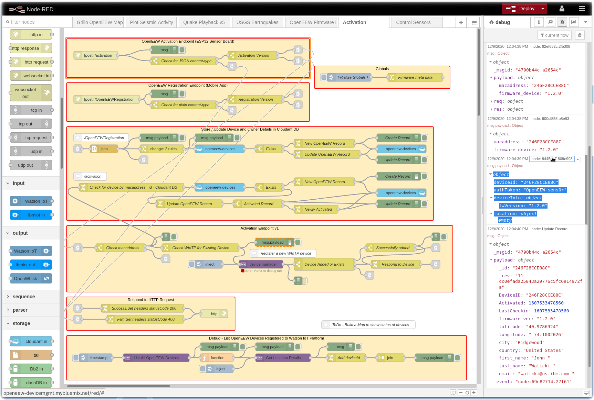
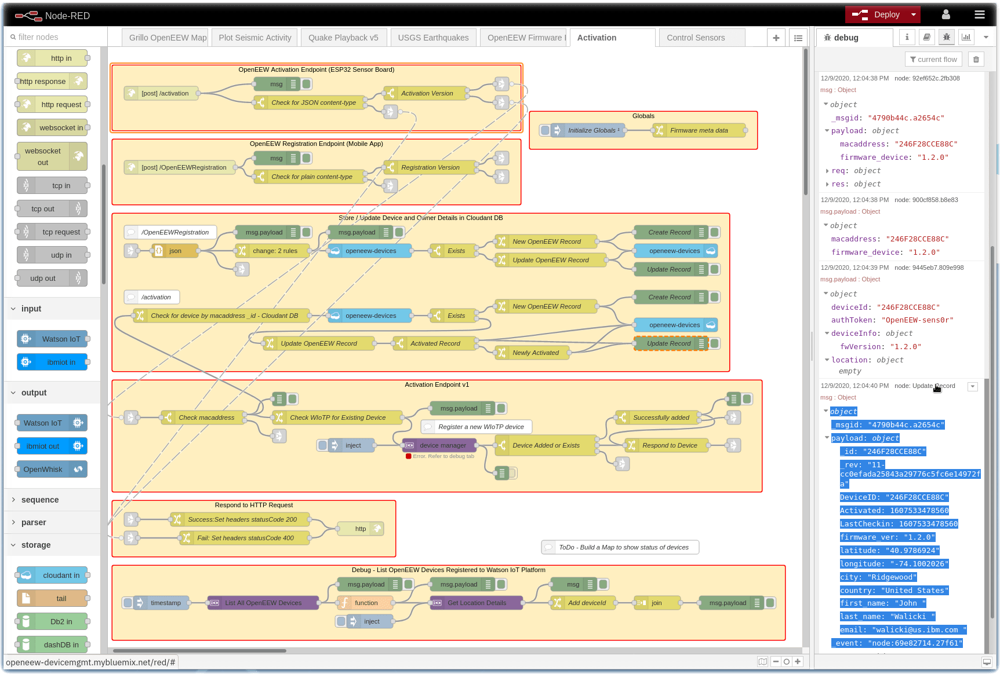
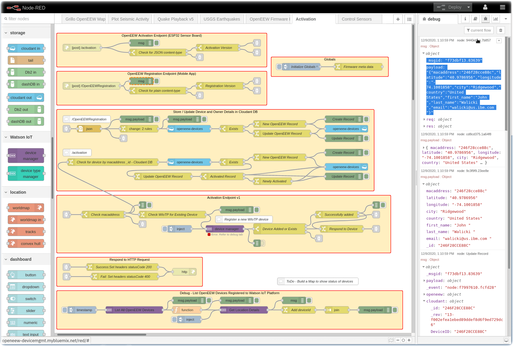
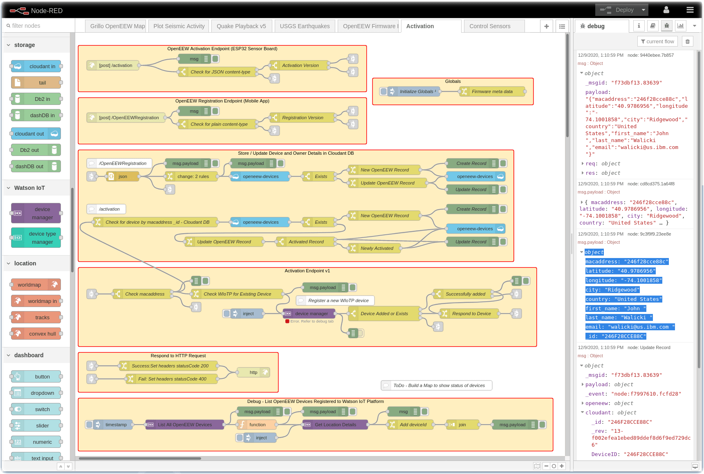

# OpenEEW Sensor Provisioning Process

This document describes the OpenEEW sensor provisioning process.



1. User enters the local wireless network SSID / Password in the OpenEEW Provisioning mobile app
1. Mobile App broadcasts the WiFi credentials via the
[SmartConfig protocol](https://community.particle.io/t/smart-config-the-missing-manual-now-available/442)
1. OpenEEW sensor board powers up, reads its NVRAM, finds no wifi credentials
it can connect to, starts to listen for
[SmartConfig encrypted frames](https://docs.espressif.com/projects/esp-idf/en/latest/esp32/api-reference/network/esp_smartconfig.html) on the network.
1. OpenEEW sensor receives the WiFi credentials and replies by sending its mac address and IP address to the OpenEEW provisioning mobile app
1. OpenEEW sensor does an http post to the /activation restful endpoint and sends its mac address and firmware version.
1. Node-RED endpoint receives the data and replies with the MQTT broker details, firmware update details (latest version and url)
1. Node-RED adds the IoT sensor device (if necessary) to Watson IoT Platform
1. Node-RED searches the Cloudant database for this mac address and adds / updates Cloudant database record with activation date and last check-in timestamps
1. While steps 5 to 8 are occurring, the user enters their First name, Last name, email address in the OpenEEW Provisioning app form.
They then review personally identifiable information - First name, Last name, email, mac address (sent from the board),
City, Country, Latitude, Longitude (which the app acquires from SmartPhone GPS).  
When they press the Register button, the data is posted to a http restful endpoint /OpenEEWRegistration
1. Node-RED endpoint receives the user information from the mobile app.
1. Node-RED searches the Cloudant database for this mac address. It then adds or updates the Cloudant record with the user data.
1. Merged record is available in the Cloudant database, indexed by mac address.  Note that either Step 8 or 11 can occur first. Order is not important.

## Detailed Steps:

### Launch OpenEEW Provisioning mobile app

- Install and launch the OpenEEW Provisioning app. Then select the **Get started** button.
<table><tr><td>
<p align="center">

</p>
</td><td>
<p align="center">

</p>
</td></tr></table>

1. In Step 1, select the **Connect via WiFi** button. Then Step 2, enter the local wireless network SSID / Password and select the **Send WiFi to OpenEEW sensor** button.
<table><tr><td>
<p align="center">

</p>
</td><td>
<p align="center">

</p>
</td></tr></table>
2. Mobile App broadcasts the WiFi credentials via the
[SmartConfig protocol](https://community.particle.io/t/smart-config-the-missing-manual-now-available/442). The debug console of the Mobile app might look like this:

```bash
I/ViewRootImpl@6d1eac9[MainActivity](16389): ViewPostIme pointer 1
D/smartconfig(16389): ssid wynd565o:pass SecretWiFiPasswordHere
D/smartconfig(16389): Begin task
D/smartconfig(16389): doing task
I/__EsptouchTask(16389): Welcome Esptouch v0.3.7.1
D/UDPSocketServer(16389): mServerSocket is created, socket read timeout: 60000, port: 18266
D/__EsptouchTask(16389): execute()
I/__EsptouchTask(16389): localInetAddress: /192.168.1.208
D/__EsptouchTask(16389): send gc code
D/__EsptouchTask(16389): __listenAsyn() start
I/__EsptouchTask(16389): expectOneByte: 31
D/UDPSocketServer(16389): receiveSpecLenBytes() entrance: len = 11
D/__EsptouchTask(16389): send gc code
D/__EsptouchTask(16389): send gc code
D/__EsptouchTask(16389): send gc code
D/__EsptouchTask(16389): send gc code
D/__EsptouchTask(16389): send gc code
D/__EsptouchTask(16389): send gc code
D/UDPSocketServer(16389): received len : 11
W/UDPSocketServer(16389): recDatas[0]:31
W/UDPSocketServer(16389): recDatas[1]:36
W/UDPSocketServer(16389): recDatas[2]:111
W/UDPSocketServer(16389): recDatas[3]:40
W/UDPSocketServer(16389): recDatas[4]:-52
W/UDPSocketServer(16389): recDatas[5]:-24
W/UDPSocketServer(16389): recDatas[6]:-116
W/UDPSocketServer(16389): recDatas[7]:-64
W/UDPSocketServer(16389): recDatas[8]:-88
W/UDPSocketServer(16389): recDatas[9]:1
W/UDPSocketServer(16389): recDatas[10]:-11
W/UDPSocketServer(16389): receiveSpecLenBytes:
I/__EsptouchTask(16389): receive correct broadcast
I/__EsptouchTask(16389): mSocketServer's new timeout is 21800 milliseconds
I/__EsptouchTask(16389): receive correct broadcast
I/System.out(16389): 24
I/System.out(16389): 6f
I/System.out(16389): 28
I/System.out(16389): cc
I/System.out(16389): e8
I/System.out(16389): 8c
D/__EsptouchTask(16389): __putEsptouchResult(): count = 1
D/__EsptouchTask(16389): __putEsptouchResult(): put one more result bssid = 246f28cce88c , address = /192.168.1.245
I/UDPSocketClient(16389): USPSocketClient is interrupt
I/UDPSocketServer(16389): USPSocketServer is interrupt
W/UDPSocketServer(16389): mServerSocket is closed
D/__EsptouchTask(16389): __listenAsyn() finish
D/smartconfig(16389): Success run smartconfig{246f28cce88c=192.168.1.245}
I/flutter (16389): {246f28cce88c: 192.168.1.245}
I/flutter (16389): 246f28cce88c
D/InputMethodManager(16389): HSIFW - flag : 0
```
3. OpenEEW sensor board powers up, reads its NVRAM, finds no wifi credentials it can connect to, starts to listen for [SmartConfig encrypted frames](https://docs.espressif.com/projects/esp-idf/en/latest/esp32/api-reference/network/esp_smartconfig.html) on the network. The serial monitor might look like this.

```bash
--- Miniterm on /dev/ttyUSB0  115200,8,N,1 ---
--- Quit: Ctrl+] | Menu: Ctrl+T | Help: Ctrl+T followed by Ctrl+H ---
Jun  8 2016 00:22:57

rst:0x1 (POWERON_RESET,
OpenEEW Sensor Application
ESP32 WiFi interface ready
Stored networks : 1
ESP32 WiFi started
Completed scan for access points
WiFi Network scan done
3 network(s) found
1: wynd565o (-66)*
2: wynd565o (-69)*
3: wynd565o (-82)*
ESP32 WiFi interface ready
Reading stored networks from NVM
ESP32 WiFi started
ESP32 WiFi started
Found network SomeOtherWiFiNetwork , xxxxxx
Got no match for network
Got no match for network
Got no match for network
Found no matches for saved networks
ESP32 WiFi interface ready
ESP32 WiFi started
Unhandled Network Interface event : 14
Waiting for SmartConfig.
ESP32 soft-AP stop
ESP32 soft-AP stop
..............
```
4. OpenEEW sensor receives the WiFi credentials and replies by sending its mac address and IP address to the OpenEEW provisioning mobile app (which can be observed in the mobile app debug log above.)
```bash
Waiting for SmartConfig.
ESP32 soft-AP stop
ESP32 soft-AP stop
..........................ESP32 WiFi connected to AP
ESP32 station got IP from connected AP
Obtained IP address: 192.168.1.245
LED_CONNECT_WIFI - Green
LED_CONNECT_WIFI - Green
LED_CONNECT_WIFI - Green
LED_CONNECT_WIFI - Green
SmartConfig received.
Waiting for WiFi
Smart Config done, connected to: wynd565o with psswd: xxxxxx
LED_CONNECT_WIFI - Green
WiFi Connected
WiFi MAC: 24:6F:28:CC:E8:8C
ETH  MAC: 24:6F:28:CC:E8:8F
246F28CCE88C
ETH Started
```
5. OpenEEW sensor does an http post to the /activation restful endpoint and sends its mac address and firmware version.
```bash
Waiting for time
.Time sync'd
Wed Dec  9 12:04:35 2020
Contacting the OpenEEW Device Activation Endpoint :
https://openeew-devicemgmt.mybluemix.net/activation?ver=1
Sending Device Activation : {"macaddress":"246F28CCE88C","firmware_device":"1.2.0"}
```
6. Node-RED endpoint receives the data and replies with the MQTT broker details, firmware update details (latest version and url)
```bash
HTTP Response code: 200
HTTP post response payload: {"org":"7p7xwk","firmware_latest":"1.2.0","firmware_ota_url":"https://openeew-devicemgmt.mybluemix.net/firmware/firmware-1.2.0.bin"}
OpenEEW Device Activation directs MQTT data from this sensor to :7p7xwk
Version 1.2.0 is equal to: 1.2.0
d:7p7xwk:OpenEEW:246F28CCE88C
MQTT_USER:use-token-auth  MQTT_TOKEN:OpenEEW-sens0r  MQTT_DEVICEID:d:7p7xwk:OpenEEW:246F28CCE88C
Attempting MQTT connection...LED_CONNECT_CLOUD - Cyan
MQTT Connected
```

7. Node-RED adds the IoT sensor device (if necessary) to Watson IoT Platform. See the fourth section of the Node-RED flow.


8. Node-RED searches the Cloudant database for this mac address and adds / updates Cloudant database record with activation date and last check-in timestamps. See third section of the Node-RED flow.


9. While steps 5 to 8 are occurring, the user enters their First name, Last name, email address in the OpenEEW Provisioning app form and then press the **Submit** button.
They then review personally identifiable information - First name, Last name, email, mac address (sent from the board),
City, Country, Latitude, Longitude (which the app acquires from SmartPhone GPS).  
When they press the **Register** button, the data is posted to a http restful endpoint /OpenEEWRegistration
<table><tr><td>
<p align="center">

</p>
</td><td>
<p align="center">

</p>
</td></tr></table>

10. Node-RED /OpenEEWRegistration endpoint receives the user information from the mobile app. See second section of the Node-RED flow.


11. Node-RED searches the Cloudant database for this mac address. It then adds or updates the Cloudant record with the user data. See third section of the Node-RED flow.


12. Merged record is available in the Cloudant database, indexed by mac address.  Note that either Step 8 or 11 can occur first. Order is not important.


13. The OpenEEW Provisioning app ends with a Thank You message.
<table><tr><td>
<p align="center">

</p>
</td></table>
